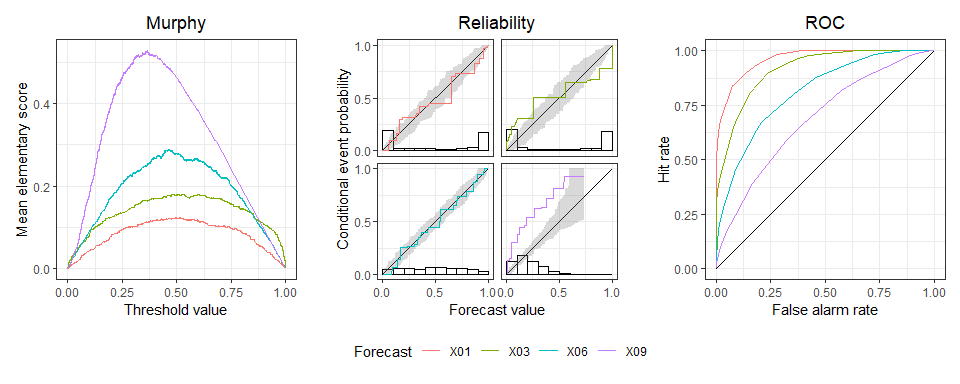
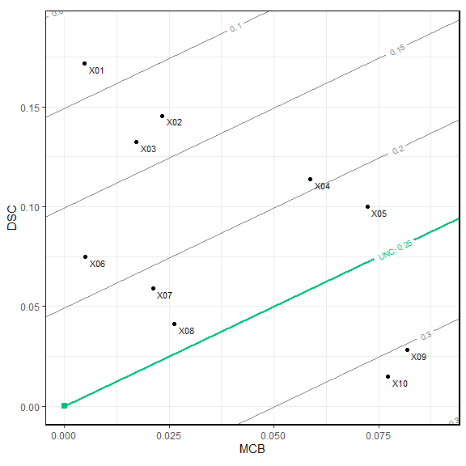

<!-- README.md is generated from README.Rmd. Please edit that file -->

# triptych : Diagnostic Graphics to Evaluate Forecast Performance

<!-- badges: start -->

[](https://CRAN.R-project.org/package=triptych)
[](https://github.com/aijordan/triptych/actions/workflows/R-CMD-check.yaml)
<!-- badges: end -->

Overall predictive performance is measured by a mean score (or loss),
which decomposes into miscalibration, discrimination, and uncertainty
components. The main focus is visualization of these distinct and
complementary aspects in joint displays. See Dimitriadis, Gneiting,
Jordan, Vogel (2023)
[arXiv:2301.10803](https://arxiv.org/abs/2301.10803).

## Installation

Install the latest release of triptych from CRAN with:

``` r
install.packages("triptych")
```

Install the development version of triptych with:

``` r
# install.packages("devtools")
devtools::install_github("aijordan/triptych")
```

## Example

``` r
library(triptych)
data(ex_binary, package = "triptych")
set.seed(20230921)

tr <- triptych(ex_binary)
tr
#> # A tibble: 10 × 5
#>    forecast          murphy     reliability             roc          mcbdsc
#>    <chr>         <trpt_mur>      <trpt_rel>      <trpt_roc>   <trpt_mcbdsc>
#>  1 X01      <named list[3]> <named list[3]> <named list[3]> <named list[3]>
#>  2 X02      <named list[3]> <named list[3]> <named list[3]> <named list[3]>
#>  3 X03      <named list[3]> <named list[3]> <named list[3]> <named list[3]>
#>  4 X04      <named list[3]> <named list[3]> <named list[3]> <named list[3]>
#>  5 X05      <named list[3]> <named list[3]> <named list[3]> <named list[3]>
#>  6 X06      <named list[3]> <named list[3]> <named list[3]> <named list[3]>
#>  7 X07      <named list[3]> <named list[3]> <named list[3]> <named list[3]>
#>  8 X08      <named list[3]> <named list[3]> <named list[3]> <named list[3]>
#>  9 X09      <named list[3]> <named list[3]> <named list[3]> <named list[3]>
#> 10 X10      <named list[3]> <named list[3]> <named list[3]> <named list[3]>

# 1. Choose 4 predictions
# 2. Add consistency bands (for reliability curves)
# 3. Create patchwork object
# 4. Adjust the title of the legend
dplyr::slice(tr, 1, 3, 6, 9) |>
  add_consistency(level = 0.9, n_boot = 100) |>
  autoplot() &
  ggplot2::guides(colour = ggplot2::guide_legend("Forecast"))
```



``` r
# From existing triptych object
estimates(tr$mcbdsc)
#> # A tibble: 10 × 5
#>    forecast mean_score     MCB    DSC   UNC
#>    <chr>         <dbl>   <dbl>  <dbl> <dbl>
#>  1 X01          0.0827 0.00474 0.172  0.250
#>  2 X02          0.127  0.0233  0.146  0.250
#>  3 X03          0.134  0.0172  0.132  0.250
#>  4 X04          0.194  0.0587  0.114  0.250
#>  5 X05          0.222  0.0723  0.100  0.250
#>  6 X06          0.180  0.00494 0.0748 0.250
#>  7 X07          0.212  0.0211  0.0590 0.250
#>  8 X08          0.235  0.0263  0.0410 0.250
#>  9 X09          0.303  0.0818  0.0282 0.250
#> 10 X10          0.312  0.0772  0.0148 0.250
autoplot(tr$mcbdsc)
```



``` r

# Or standalone:
# mcbdsc(ex_binary) |> estimates()
# mcbdsc(ex_binary) |> autoplot()
```
